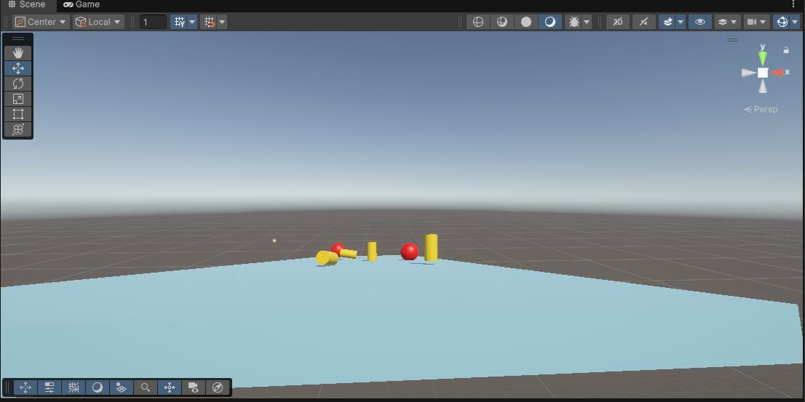

### **[게임프로그래밍04 RUN 요약 자료](#)**
- Standard Assets 임포트  
- ThirdPersonController 캐릭터 배치  
- Floor 여러 개로 스테이지 구성  
- Wall, Pillar 배경 오브젝트 배치  
- Block 장애물 배치 및 이동 처리  
- FailZone(낙하 → 재시작) 트리거 구성  
- GoalArea(도착) 트리거 구성  
- Coin 생성, CoinTrigger로 획득 처리  
- Tag 사용(Coin/Obstacle 그룹화)  
- RedCoin 아이템으로 장애물 일괄 제거  
- GameManager로 재시작·동전 카운트·UI 관리  
- TextMeshPro로 획득 동전 UI 표시  
- Stone(투사체) 생성 및 충돌 처리  
- Shooter 오브젝트에서 일정 시간마다 돌 생성  
- Prefab 활용(stone 프리팹 생성 후 Instantiate)  
- ObstacleMove 상속하여 Shooter 이동 처리  
   
---

### **[게임프로그래밍05 C# Script 입문 요약 자료](#)**
- Unity 3D 프로젝트 생성  
- Cube로 Ground 생성 및 Material 적용  
- Camera/Light 기본 세팅  
- Sphere(Ball) 생성 및 Rigidbody 추가  
- C# Script 생성(PrtPosition)  
  - 위치 출력  
  - if문 조건 분기  
  - 특정 distance 시 1회만 출력  
- RadiusChange로 SphereCollider radius 변경  
- CameraFollow로 Ball 추적  
- GroundMove로 Stage 기울이기(키보드 / 마우스 입력)  
- BallJump로 Space 입력 시 점프  
- Obstacle 생성 및 좌우 이동 스크립트  
- Stage 오브젝트로 Ground+Obstacle 그룹화  
- Collision 처리(OnCollisionEnter)  
- FailZone 트리거로 재시작(SceneManager.LoadScene)  
- Coin 생성 및 트리거 이벤트로 제거  
- Tag 기반 여러 Coin 접근  
- 장애물+코인 조합한 Stage 구성    
  

